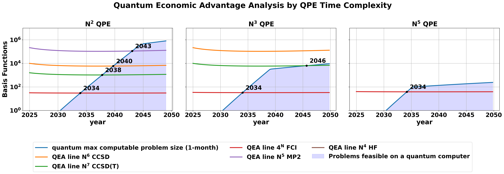

# Quantum Advantage in Computational Chemistry

Code to examine the potential of quantum computers for quantum chemistry.
chemistry.ipynb generates most of the plots and predictions used in our paper.

